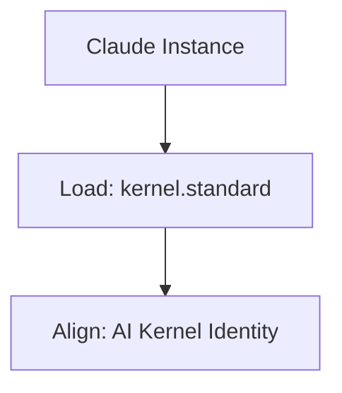

# Claude Instructions

## Context
This file provides the primary instruction set for the Claude environment to ensure alignment with the AI Kernel's standards and workflows.

## Architecture

## Instructions
Read and follow all instructions in **[AGENTS.md](AGENTS.md)** in this repository.
Every action taken by Claude must be verified against the **Kernel Standard**.
