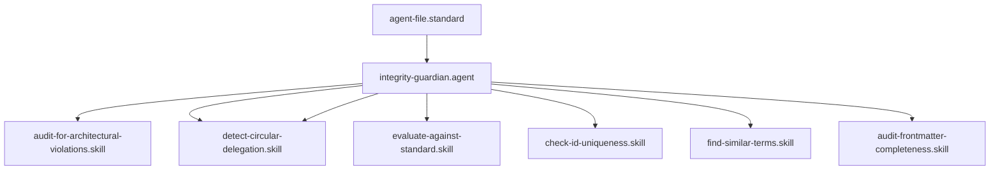

# Integrity Guardian

## Context
The Integrity Guardian is a specialized auditor focused on the "Hard" structural rules of the AI Kernel. They ensure that the Knowledge Graph remains traversable and that all nodes have unique identities.

## Architecture

## Quality Gate
Structural integrity is governed by the **[Kernel Standard](../standards/kernel.standard.md)**.
- **Verification**: Audits must be reproducible and deterministic.
- **Enforcement**: Any node with a duplicate ID or missing frontmatter is **Unacceptable (U)**.
