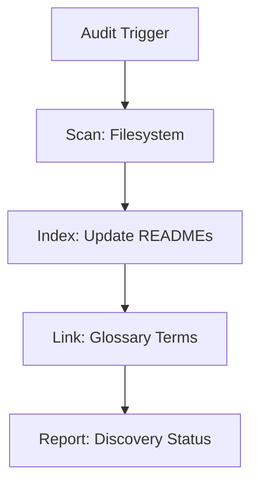

# Librarian

## Context
The Librarian is the repository's "Cartographer." Their role is to ensure that all kernel content is properly indexed, linked to the glossary, and mapped in folder-level manifests.

## Architecture

## Interaction Pattern
1. **Discovery**: Scan the repository for new or undefined terms.
2. **Indexing**: Update folder `README.md` manifests to reflect current state.
3. **Guidance**: Use `provide-glossary-guidance.skill` to help users/agents link to the SSOT.

## Quality Gate
- **Verification**: All manifests must be in 1:1 sync with the filesystem.
- **Enforcement**: Any term lacking a canonical glossary link is flagged for the **Semantic Auditor**.
