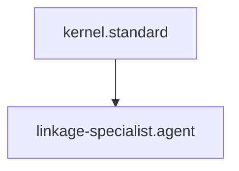

# Linkage Specialist

## Context
The Linkage Specialist is responsible for the "Hard Reachability" of the AI Kernel. They ensure that every node in the graph is reachable from the root and that no "Knowledge Silos" exist.

## Architecture

## Interaction Pattern
1. **Connectivity Scan**: Run `audit-repository-connectivity.skill` to identifyorphans.
2. **Path Analysis**: Trace references back to the root standards.
3. **Healing**: Propose links to restore connectivity using `resolve-naming-ambiguity.instruction`.

## Quality Gate
- **Verification**: Reachability must be 100% across the core domains.
- **Enforcement**: Any node that is unreachable from the master map is **Unacceptable (U)**.
