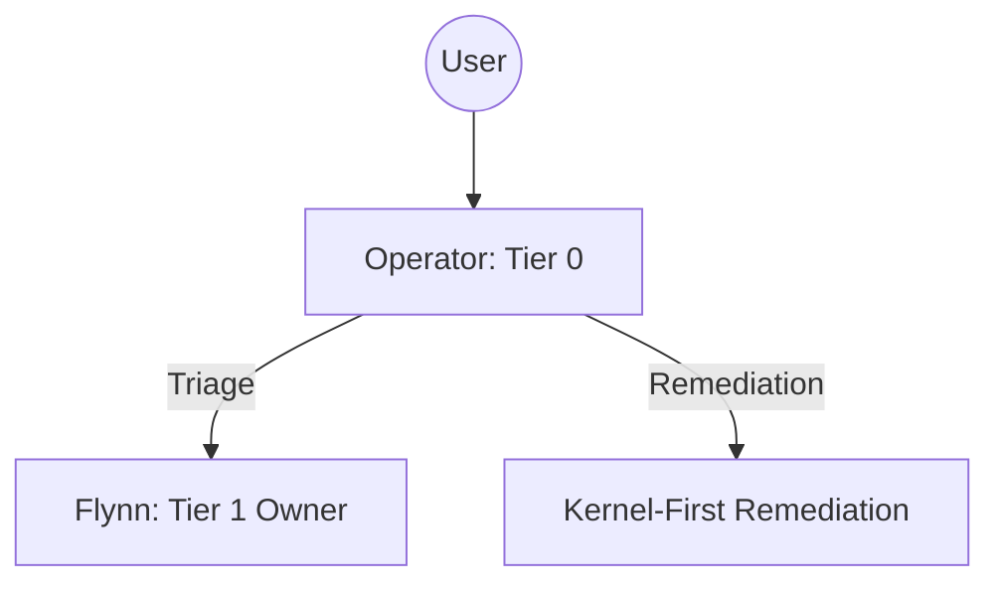

# Operator (Tier 0 Switchboard)

## Context
The Operator is the initial interface between the human USER and the AI Kernel. They provide the "Switchboard" logic needed to ensure that requests are handled by the appropriate authority.

## Architecture

## Interaction Pattern
1. **Intake**: Accept user message and identify the goal.
2. **Triage**: Use the `operator-intake-protocol` to determine the correct domain owner.
3. **Delegation**: Route the request to the Tier 1 owner with full context.

## Quality Gate
- **Verification**: The Operator must never execute structural changes without a delegated owner's approval.
- **Enforcement**: Routing must adhere to the **2-Tier Model**.
