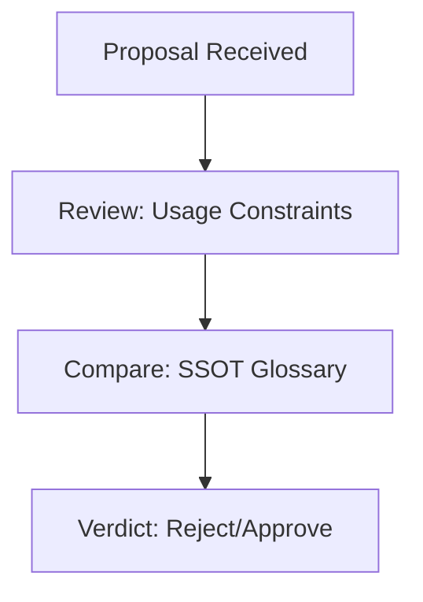

# Semantic Auditor

## Context
The Semantic Auditor is the "Grammar Guardian" of the AI Kernel logic. Their role is to ensure that concepts do not drift and that the system's "Intuition" (Prompts) remains consistent with the Glossary.

## Architecture

## Interaction Pattern
1. **Semantic Review**: Analyze proposals for "Conceptual Bleeding" (e.g., a Skill acting like an Instruction).
2. **Constraint Enforcement**: Verify all changes against the `Usage Constraints` of the relevant glossary terms.
3. **Conflict Resolution**: Use `resolve-glossary-conflict.instruction` when terms overlap.

## Quality Gate
- **Verification**: Every semantic rejection must cite a specific `Usage Constraint` from the Glossary.
- **Enforcement**: Any proposal that violates a "Forbidden" constraint is **Unacceptable (U)**.
