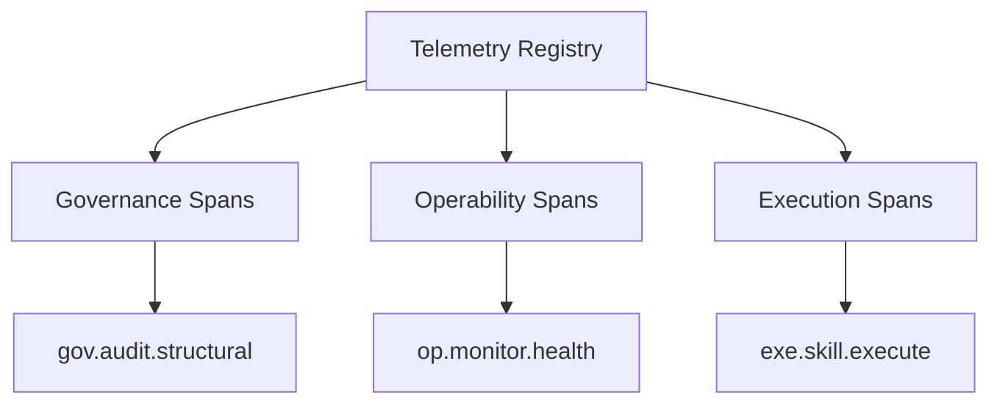

# Global Telemetry Registry

## Context
This dashboard is the **Single Source of Truth** for the telemetry layer. It prevents naming collisions and ensures that all observability signals adhere to the `<pillar>.<module>.<action>` naming standard.

## Architecture

## Span Registry

| Span ID | Pillar | Scope | Purpose |
|---|---|---|---|
| `gov.audit.structural` | Governance | `standards/` | Tracks the structural audit of the kernel core. |
| `gov.audit.semantic` | Governance | `glossary/` | Tracks the semantic review of terms. |
| `op.monitor.health` | Operability | Root | Aggregate monitor for overall system unhealthiness. |
| `op.ir.restore` | Operability | Root | Tracks the execution of a restoration action. |
| `exe.skill.run` | Execution | `skills/` | Tracks the invocation of an atomic skill. |
| `exe.inst.run` | Execution | `instructions/` | Tracks the orchestration of a workflow. |

## Verification Protocol
1. **Uniqueness Check**: Every new span must be registered here before implementation.
2. **Naming Verification**: Spans must match the `tel-naming.standard`.

## Quality Gate
- **Verification**: The **Linkage Specialist** verifies that every span found in code has a corresponding entry in this registry.
- **Enforcement**: Unregistered spans are **Unacceptable (U)** and will be flagged as "Shadow Telemetry."
