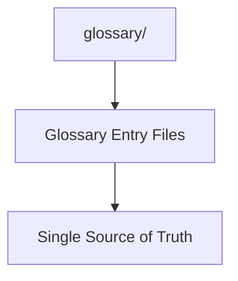

# Glossary Manifest

## Context
This folder contains the Single Source of Truth (SSOT) for all terms and concepts in the AI Kernel.

## Architecture

## File Registry

| ID | Type | Summary |
|---|---|---|
| `determinism.glossary` | Glossary | Predictability quality bar. |
| `reachability.glossary` | Glossary | Linkage quality bar. |
| `hard-logic.glossary` | Glossary | Structural rule stability. |
| `capability.glossary` | Glossary | License to act token. |
| `agent.glossary` | Glossary | Autonomous role definition. |
| `skill.glossary` | Glossary | Atomic capability definition. |
| `instruction.glossary` | Glossary | Workflow definition. |
| `standard.glossary` | Glossary | Governance rule definition. |
| `quality-gate.glossary` | Glossary | Verification bar definition. |

## Quality Gate
- **Verification**: Every entry must include **Usage Constraints**.
- **Enforcement**: This manifest must be in 1:1 sync with the filesystem.
