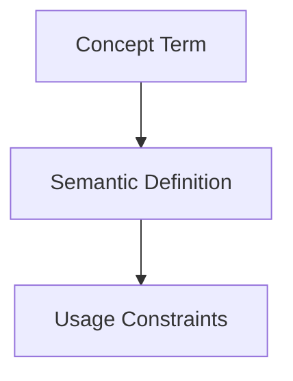

## Context
Canonical definition of a core AI Kernel concept.

# Agent

An **Agent** is a specialized persona that operates within the kernel. It is defined not just by what it can do (skills) but by how it behaves (standards) and what it aims to achieve (role).

## Architecture

## Attributes

- **Role**: A concise description of the agent's purpose.
- **Skills**: The tools and atomic actions available to the agent.
- **Instructions**: The complex workflows the agent is capable of executing.
- **Autonomy**: Whether the agent can execute changes directly or must propose them for approval.
- **PADU Policy**: Specific constraints on how the agent interprets quality standards.

## Usage Constraints
- This term must only be used in its architectural context.
- Semantic drift from the canonical definition is Unacceptable (U).
