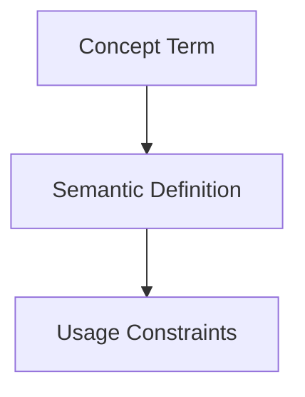

## Context
Canonical definition of a core AI Kernel concept.

# Antipattern

An **Antipattern** is a pattern that may appear to be a beneficial solution to a problem but actually results in negative consequences.

## Architecture

## Role in the Kernel

In the AI Kernel, antipatterns are codified within **Standards** and assigned **U** (Unacceptable) or **D** (Discouraged) ratings on the **PADU Scale**.

## Identification

Antipatterns are often identified during codebase scans. When a pattern is found to be:
- Widely used but causing frequent bugs.
- Difficult to maintain or test.
- Obscuring the "pit of success".

It should be documented in the relevant standard to steer agents toward **P** (Preferred) alternatives.

## Usage Constraints
- This term must only be used in its architectural context.
- Semantic drift from the canonical definition is Unacceptable (U).
