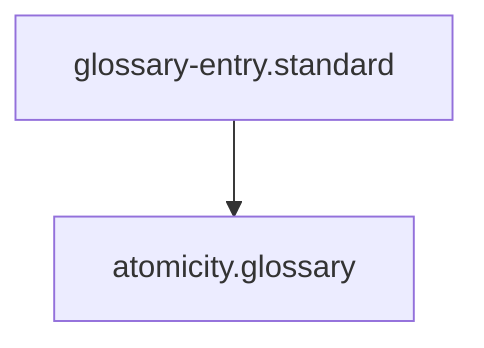

## Context
Canonical definition of a core AI Kernel concept.

# Atomicity

**Atomicity** is the core design principle for **Skills** in the AI Kernel.

## Architecture

## Principles

- **Single Action**: A skill should do one thing (e.g., "Search", "Update File").
- **Single Tool**: A skill should rely on one primary tool (e.g., `grep`, `editor`).
- **Statelessness**: A skill should not rely on the side effects of other skills beyond its explicit inputs.

Atomic skills are easier to test, reuse, and sequence into complex **Instructions**.

## Usage Constraints
- This term must only be used in its architectural context.
- Semantic drift from the canonical definition is Unacceptable (U).
