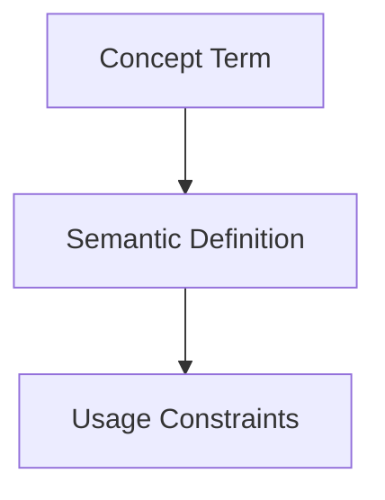

## Context
Canonical definition of a core AI Kernel concept.

# Authority

**Authority** defines the boundaries of an agent's power within the repository.

## Architecture

## Levels

- **Propose**: The agent can generate code changes or new files and present them for user approval.
- **Suggest**: The agent can only provide textual recommendations or analysis without drafting specific file modifications.
- **Execute**: (Discouraged) The agent can commit changes directly. This level is reserved for high-confidence maintenance tasks.

## Usage Constraints
- This term must only be used in its architectural context.
- Semantic drift from the canonical definition is Unacceptable (U).
