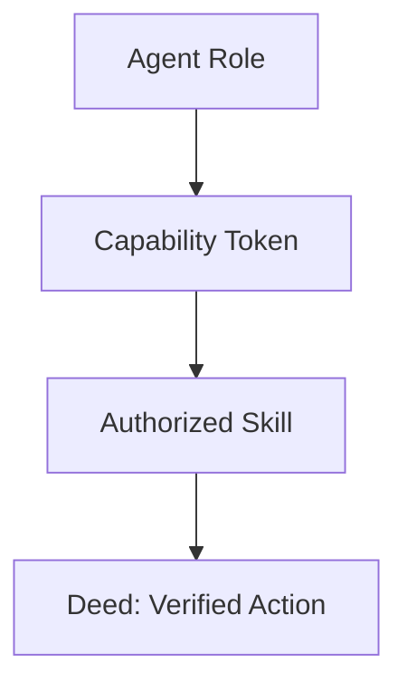

# Capability

## Context
Capabilities are the "Tokens" of the agent governance model. They define what an agent is *capable* of doing, whereas **Authority** defines what they are *permitted* to propose.

## Architecture

## Usage Constraints
- A Capability must be explicitly listed in the `capabilities` field of the agent frontmatter.
- An agent must not invoke a Skill for which it does not possess the corresponding Capability token.
- Capability grants are governed by the **Capability Standard**.
