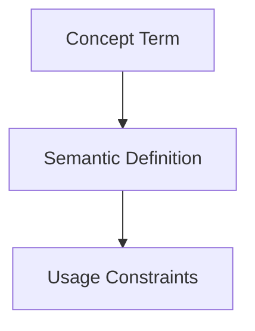

## Context
Canonical definition of a core AI Kernel concept.

# Context

**Context** refers to the persistent state and knowledge gathered during interactions. In the AI Kernel, context is explicitly managed to overcome the limitations of transient conversation windows.

## Architecture

## Usage

- **Directory**: Stored in the `/context/` folder.
- **Persistence**: Unlike conversation logs, context files are curated and maintained as part of the repository.
- **Agent Awareness**: Agents use context files to understand project-specific nuances without needing to be re-taught in every session.

## Usage Constraints
- This term must only be used in its architectural context.
- Semantic drift from the canonical definition is Unacceptable (U).
