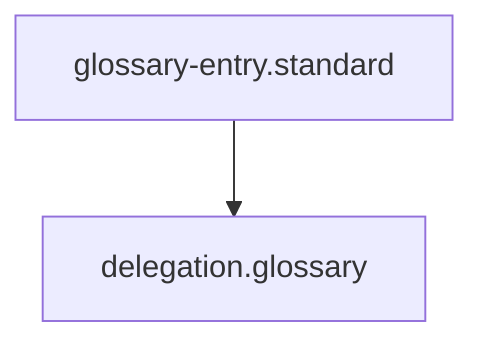

## Context
Canonical definition of a core AI Kernel concept.

# Delegation

**Delegation** is the mechanism by which agents in the AI Kernel collaborate. It allows a generalist agent to invoke a specialized agent (e.g., Flynn or the Standards Auditor) to handle a specific domain.

## Architecture

## Principles

- **Explicit Authority**: An agent must have the `delegates` field defined in its frontmatter to task another agent.
- **Goal-Oriented**: Delegation should include a clear objective or a specific instruction to execute.
- **Reporting**: The delegated agent should report its findings or results back to the initiating agent.

## Usage Constraints
- This term must only be used in its architectural context.
- Semantic drift from the canonical definition is Unacceptable (U).
