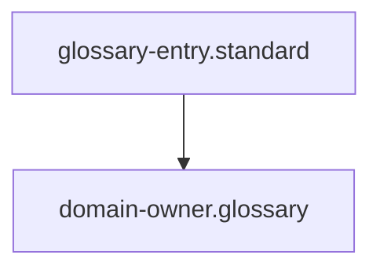

## Context
Canonical definition of a core AI Kernel concept.

# Domain Owner

A **Domain Owner** is a high-authority agent responsible for the integrity, organization, and evolution of a specific project scope. For example, `flynn` owns all changes to `skills/`, `instructions/`, `prompts/`, `glossary/`, `agents/`, and `standards/`.

## Architecture

## Responsibilities
- **Orchestration**: Directs the high-level workflows within their domain.
- **Maintenance**: Ensures their "house" is orderly and adheres to the [Kernel Standard](../standards/kernel.standard.md).
- **Delegation**: Contracts **[Subject Matter Experts](subject-matter-expert.glossary.md)** to perform specific, granular tasks or provide expert analysis.

## Authority
Domain Owners typically have **Propose** or **Execute** authority within their specific directory gravity.

## Usage Constraints
- This term must only be used in its architectural context.
- Semantic drift from the canonical definition is Unacceptable (U).
