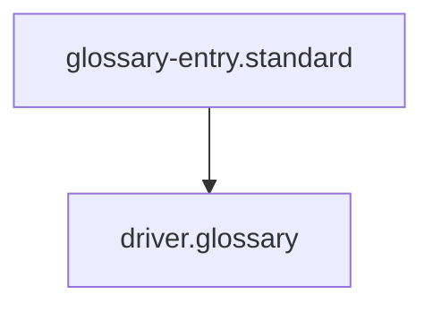

# Driver

## Context
In the AI Kernel hierarchy, the **Driver** is the "Bottom Layer" of execution. It is the bridge between the agent's intent (Skill) and the physical action (Execution). 

## Usage Constraints
- **Atomicity**: A driver must never attempt to perform multi-step orchestration. Orchestration belongs in **Instructions** or **Agents**.
- **Determinism**: Given the same inputs, a driver must produce the same machine-readable output.
- **Portability**: Drivers should be self-contained and easily executable from any shell.

## Architecture

