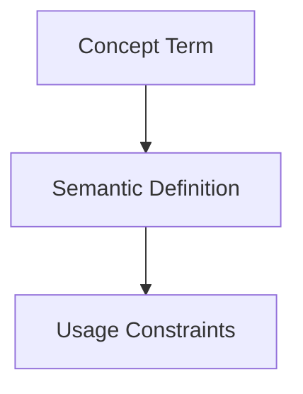

## Context
Canonical definition of a core AI Kernel concept.

# Frontmatter

**Frontmatter** is a block of YAML-formatted data located at the very beginning of a file, delimited by triple dashes (`---`).

## Architecture

## Role in the Kernel

- **Discovery**: Agents scan frontmatter to find files by tag, type, or ID without reading the full body.
- **Linking**: Provides machine-readable references (`glossary_refs`, `standards`) that tools can use to build a knowledge graph.
- **Scanning Efficiency**: Supports **Progressive Disclosure** by providing a `summary` field.

## Usage Constraints
- This term must only be used in its architectural context.
- Semantic drift from the canonical definition is Unacceptable (U).
