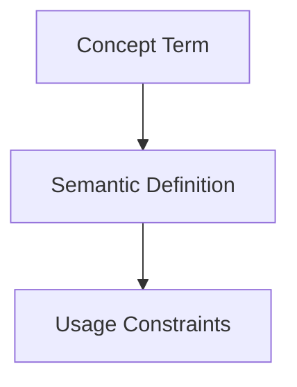

## Context
Canonical definition of a core AI Kernel concept.

# Glossary Entry

A **Glossary Entry** is the fundamental unit of knowledge in the AI Kernel. It provides a single, canonical definition for a term to prevent ambiguity and duplication across the codebase and documentation.

## Architecture

## Purpose

- **Single Source of Truth**: Ensures all agents and humans use the same definition for a concept.
- **Ambiguity Reduction**: Clarifies jargon and project-specific terminology.
- **Machine Discovery**: Enables agents to find definitions programmatically via frontmatter tags and IDs.

## Structure

Every glossary entry must include:
1. **YAML Frontmatter**: Standard metadata including ID, title, aliases, and summary.
2. **Definition**: A concise explanation of the concept.
3. **Usage Context**: Examples of how the term is used in the project.

## Usage Constraints
- This term must only be used in its architectural context.
- Semantic drift from the canonical definition is Unacceptable (U).
