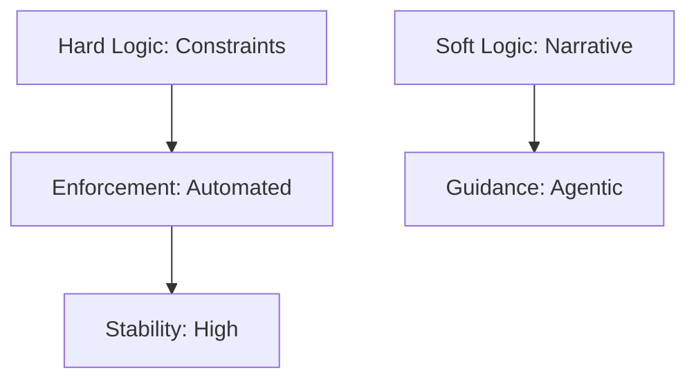

# Hard Logic

## Context
"Hard Logic" is the skeleton of the AI Kernel. It stands in contrast to "Soft Logic" (Descriptions, Summaries, Narrative). The Hard Logic must be stable and deterministic to ensure the system remains predictable as it scales.

## Architecture

## Usage Constraints
- Hard Logic must be defined in a **Standard** or **Skill**.
- Soft Logic must never supersede Hard Logic in a **Quality Gate**.
- Changes to Hard Logic require **Tier 1 (Domain Owner)** approval.
