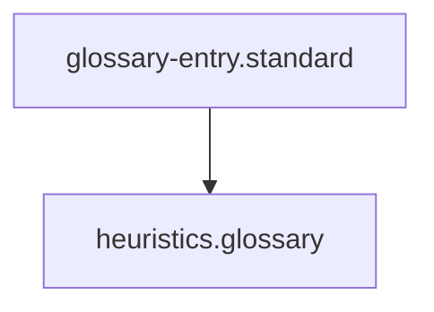

## Context
Canonical definition of a core AI Kernel concept.

# Heuristics

**Heuristics** are practical methods for problem-solving or discovery that are not guaranteed to be optimal or perfect, but are sufficient for the immediate goals.

## Architecture

## In the Kernel

In the AI Kernel, heuristics are used by agents (like **Flynn**) to handle edge cases or determine the "weight" of a concept during glossary onboarding. They provide the "wisdom" layer above the rigid rules of a PADU table.

## Usage Constraints
- This term must only be used in its architectural context.
- Semantic drift from the canonical definition is Unacceptable (U).
