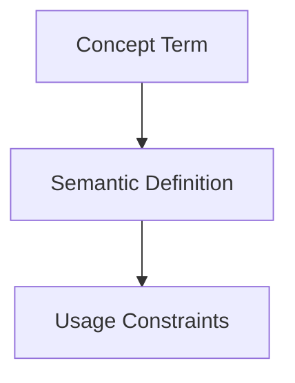

## Context
Canonical definition of a core AI Kernel concept.

# Knowledge Graph

The **Knowledge Graph** is the conceptual map of the AI Kernel. It is formed by the machine-readable links (IDs and references) defined in the YAML frontmatter of each file.

## Architecture

## Utility

- **Discovery**: Agents navigate the graph to find related content.
- **Integrity**: Tools like `verify-repository-integrity` ensure the graph has no broken nodes.
- **Context**: The graph allows agents to understand the relationship between a low-level skill and the high-level standard it enforces.

## Usage Constraints
- This term must only be used in its architectural context.
- Semantic drift from the canonical definition is Unacceptable (U).
