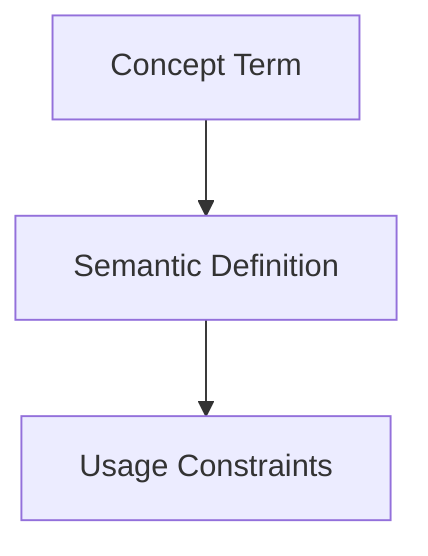

## Context
Canonical definition of a core AI Kernel concept.

# Progressive Disclosure

**Progressive Disclosure** is an optimization strategy for AI agents. It involves providing just enough information for the agent to decide if a file is relevant before loading the entire content.

## Architecture

## Implementation

In the AI Kernel, this is achieved by:
1. **Scanning**: Agents first read only the YAML frontmatter of potential files.
2. **Decision**: Based on the `summary`, `tags`, and `id`, the agent decides if the file is needed.
3. **Fetching**: The agent then loads the full body of only the relevant files.

This significantly reduces token costs and keeps the agent's context focused on the task at hand.

## Usage Constraints
- This term must only be used in its architectural context.
- Semantic drift from the canonical definition is Unacceptable (U).
