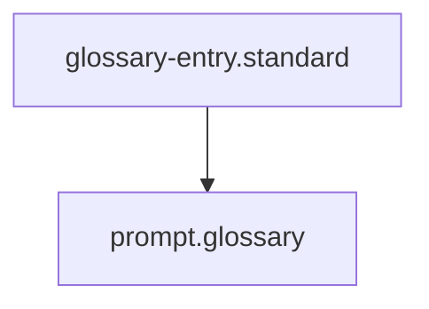

## Context
Canonical definition of a core AI Kernel concept.

# Prompt

A **Prompt** in the AI Kernel is a standalone artifact designed to guide AI behavior for a specific, recurring task.

## Architecture

## Utility
While **Skills** use tools and **Agents** have roles, **Prompts** provide the "personality" or "logic" for the LLM itself. They are extracted into the `prompts/` directory when they have utility across multiple skills or agents, preventing duplication of complex prompt engineering.

## Standards
Prompts are governed by the [Prompt File Standard](../standards/prompt-file.standard.md).

## Usage Constraints
- This term must only be used in its architectural context.
- Semantic drift from the canonical definition is Unacceptable (U).
