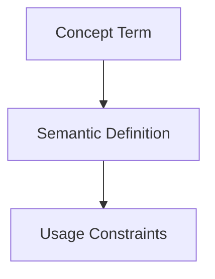

## Context
Canonical definition of a core AI Kernel concept.

# Quality Gate

A **Quality Gate** is a mandatory validation step within an **Instruction**. It ensures that no work proceeds to the next stage unless it meets the criteria defined in a specific **Standard**.

## Architecture

## Implementation

In the AI Kernel, quality gates are implemented by invoking the `evaluate-against-standard` skill. If the output contains **U** (Unacceptable) ratings, the gate remains closed until corrections are made.

## Usage Constraints
- This term must only be used in its architectural context.
- Semantic drift from the canonical definition is Unacceptable (U).
