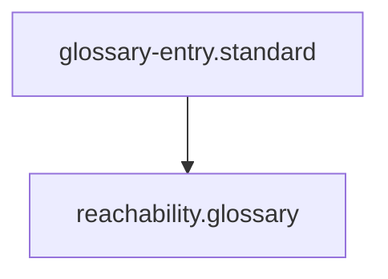

# Reachability

## Context
Reachability ensures that the AI Kernel is a single, connected Knowledge Graph rather than a collection of isolated silos. It is the prerequisite for automated auditing and knowledge discovery.

## Architecture

## Usage Constraints
- A node is "Unreachable" if it has no incoming references from a parent standard or master map.
- Reachability must be verified via the `audit-repository-connectivity.skill`.
