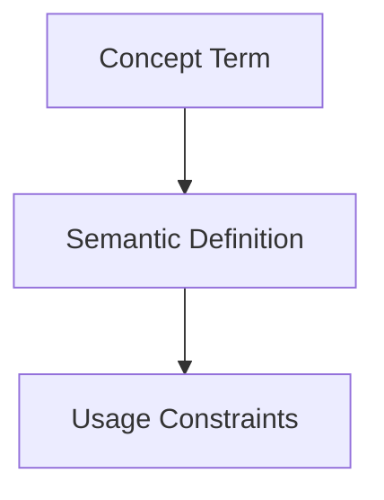

## Context
Canonical definition of a core AI Kernel concept.

# Skill

A **Skill** is a discrete capability that leverages specific tools (e.g., git, grep, editor) to perform a task. Skills are the building blocks of automated workflows.

## Architecture

## Design Principles

- **Atomicity**: A skill should do one thing well.
- **Tool-Centricity**: Explicitly defines which tools are required.
- **Input/Output Contract**: Clearly specifies what it needs and what it produces.

## Usage

Skills are referenced in **Instructions** (multi-step sequences) and assigned to **Agents** (autonomous actors).

## Usage Constraints
- This term must only be used in its architectural context.
- Semantic drift from the canonical definition is Unacceptable (U).
