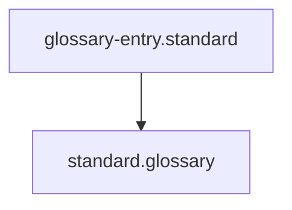

## Context
Canonical definition of a core AI Kernel concept.

# Standard

A **Standard** is a formal document that defines the quality bars and constraints for a specific domain (e.g., C++ coding, documentation structure, API design).

## Architecture

## Key Characteristics

- **PADU Scale**: Uses Preferred, Acceptable, Discouraged, and Unacceptable ratings to categorize practices.
- **Enforcement**: Standards are used by skills and agents to validate work products.
- **Scope**: Clearly defines which files or actions the standard applies to.

## Components

1. **Frontmatter**: Defines the `scope` and `applies_to` fields.
2. **PADU Table**: The core logic of the standard, mapping practices to ratings.
3. **Rationale**: Explanations for why certain practices are rated the way they are.

## Usage Constraints
- This term must only be used in its architectural context.
- Semantic drift from the canonical definition is Unacceptable (U).
