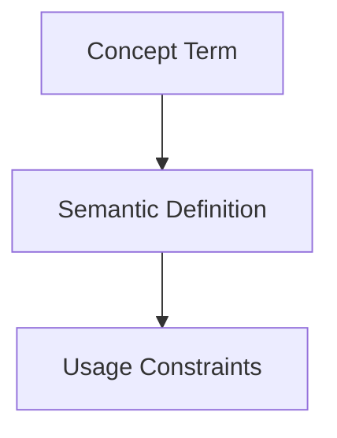

## Context
Canonical definition of a core AI Kernel concept.

# Subject Matter Expert (SME)

A **Subject Matter Expert** is a specialized agent designed to handle a single dimension of the repository's logic.

## Architecture

## Per-Domain Instantiation
SMEs are not singletons. While their **Definition** (e.g., `librarian.agent.md`) is shared, their **Context** and **Deployment** are scoped to the [Domain Owner](domain-owner.glossary.md) who invokes them.

- **Flynn's Librarian**: Audits the AI Kernel core.
- **App-Agent's Librarian**: Audits a sidecar application repository.

These are distinct "contractors" who use the same skills and standards but operate on entirely different filesystems and data sets.

## Responsibilities
- **Expert Opinion**: Provides analysis when invoked by a Domain Owner.
- **Contractual Work**: SMEs operate within the boundaries set by the owner.
- **Isolation**: An SME's findings in one domain do not automatically bleed into another unless explicitly shared by a higher-tier agent.

## Usage Constraints
- This term must only be used in its architectural context.
- Semantic drift from the canonical definition is Unacceptable (U).
