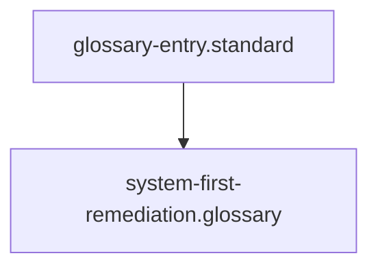

# System-First Remediation

## Context
System-First Remediation is the fundamental operating philosophy of the AI Kernel. It rejects "Patching" (fixing a single output) in favor of "Structural Healing" (fixing the rule that allowed the error).

## Architecture

## Synonyms (Human Reference)
- **Codify Feedback**: Turning a user correction into a permanent kernel rule.
- **Kernel-First Remediation**: The legacy term for this philosophy.
- **Fix the Factory**: The mnemonic for prioritizing the logic over the product.

## Usage Constraints
- Must be invoked for every user-reported error or sub-optimal output.
- Is forbidden to perform manual fixes without first checking the **Governing Standard**.
- Requires a **Meta-Audit** of the updated kernel node before re-execution.
