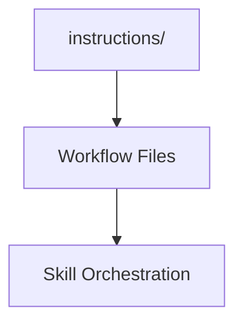

# Instructions Manifest

## Context
This folder contains the multi-step workflows and orchestration logic of the AI Kernel.

## Architecture

## File Registry

| ID | Type | Summary |
|---|---|---|
| `maintain-kernel-integrity.instruction` | Instruction | Master self-healing loop. |
| `perform-meta-audit.instruction` | Instruction | Synthesized system health report. |
| `perform-atomic-extraction.instruction` | Instruction | Workflow for de-conflating content. || `handle-incident.instruction` | Instruction | Standard restoration workflow. |
| `resolve-naming-ambiguity.instruction` | Instruction | Workflow for ID collision resolution. |
| `system-first-remediation.instruction` | Instruction | Workflow for addressing drift. |
| `codify-emerging-pattern.instruction` | Instruction | Workflow for pattern formalization. |

## Quality Gate
- **Verification**: Every instruction must include **Postconditions**.
- **Enforcement**: This manifest must be in 1:1 sync with the filesystem.
