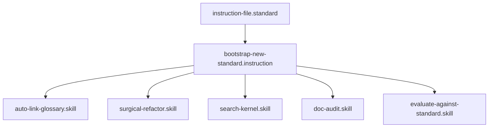

## Context
Orchestrates the full process of researching, drafting, auditing, and committing a new technical standard.

# Bootstrap New Standard

This is the primary workflow for expanding the AI Kernel's reach into new domains.

## Architecture

## Execution Steps

1. **Research & Draft**: Execute the [populate-standard.instruction](populate-standard.instruction.md) instruction.
2. **Glossary Alignment**: For any new terms identified in Step 1, create new glossary entries using the [create-glossary-entry.instruction](create-glossary-entry.instruction.md) instruction.
3. **Refine**: Address any meta-standard violations identified during the draft.
4. **Final Audit**: Task the **[Standards Auditor](../agents/standards-auditor.agent.md)** to perform a final compliance pass.
5. **Commit**: Save the new standard and all supporting glossary entries.

## Postconditions
1. The system state matches the goal defined in the frontmatter.
2. All related Knowledge Graph nodes are updated and linked.

## Quality Gate

Expansion integrity is governed by the **[Standard File Standard](../standards/standard-file.standard.md)**.
- **Verification**: Run `evaluate-against-standard.skill` on the final draft. Ensure a 100% pass rate against the meta-standard.
- **Enforcement**: If any **Unacceptable (U)** violations remain, the standard must not be committed to the `standards/` directory.
