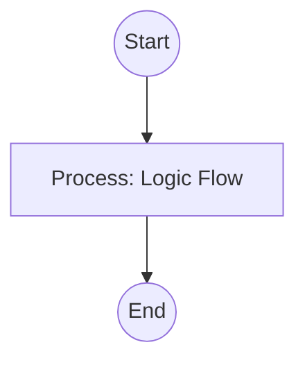

## Context
Orchestration for discovering, researching, and formalizing an emerging pattern into a hierarchical standard.

# Codify Emerging Pattern

This instruction provides the workflow for the **Standards Scout** to aggressively expand the repository's governance.

## Architecture

## Steps

1. **Pattern Discovery**: Run `scan-codebase-patterns.skill` to collect real-world examples of the practice.
2. **Domain Research**: Run `research-domain-patterns.skill` to identify industry best practices and potential anti-patterns.
3. **Atomic Synthesis**:
    - Identify the specific, narrow objective of the pattern.
    - If the pattern is too broad, split it into multiple sub-topics.
4. **Draft PADU**: Run `generate-padu-table.skill` to create the practice ratings and rationales.
5. **Hierarchy Mapping**:
    - Select a `parent_standard` from the existing `standards/` directory.
    - Assign a Context-Qualified name following the [Naming Standard](../standards/naming.standard.md).
6. **[Quality Gate](glossary/quality-gate.glossary.md)**:
    - Invoke the **[Semantic Auditor](../agents/semantic-auditor.agent.md)** to verify that the new standard is atomic and not overlapping with existing rules.
    - Ensure every practice has an **Enforcement** method.
7. **Final Review**: Present the new `.[standard].md` file to **Flynn** for approval.

## Postconditions
1. The system state matches the goal defined in the frontmatter.
2. All related Knowledge Graph nodes are updated and linked.
