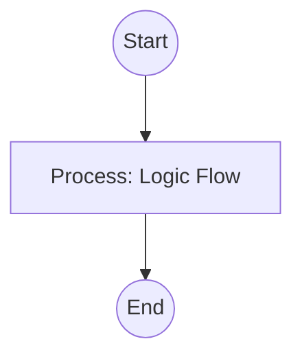

## Context
A workflow for adding a new concept to the glossary while ensuring quality and preventing duplication.

# Create Glossary Entry

Follow these steps to add a new concept to the AI Kernel.

## Architecture

## Steps

1. **Check for Existence**: Run the `find-glossary-terms` skill with the new term and any likely aliases. If a match is found, do NOT proceed. Link to the existing entry instead.
2. **Draft Content**: Create a new markdown file in `glossary/` using the `{term-id}.md` naming convention.
3. **Populate [Frontmatter](glossary/frontmatter.glossary.md)**: Ensure all required fields (ID, title, type, summary, created, updated) are present.
4. **Write Body**: Provide a clear definition and usage context.
5. **Quality Audit**: Run the `evaluate-against-standard` skill on the draft using `glossary-entry-standard`.
6. **Refine**: Fix any issues identified in the audit (e.g., missing summary, missing tags).
7. **Commit**: Save the file and propose a commit message.

## Postconditions
1. The system state matches the goal defined in the frontmatter.
2. All related Knowledge Graph nodes are updated and linked.
