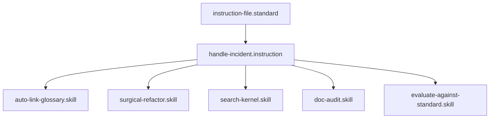

# Handle Incident

## Context
This instruction defines the bridge between **Detection** and **Restoration**. It ensures that when an alert fires, the responder follows a deterministic path that eliminates "Creative Troubleshooting" in favor of "Systemic Healing."

## Architecture

## Execution Steps

1. **Intake**: Accept the aggregate alert signal.
2. **Dashboard Review**: Open the **[Span Diagnostic Dashboard](../standards/inc-response.standard.md)** linked in the alert.
3. **Identification**: Identify which specific spans are reporting unhealthiness.
4. **Prioritization**: If multiple spans are failing, prioritize the "Critical Path" (e.g., Auth over Logging).
5. **Diagnostic Runbook**: Open the **[Span Diagnostic Runbook](../standards/inc-response.standard.md)** for the highest-priority failing span.
6. **Execution**:
    - **Verify**: Run the verification step defined in the runbook.
    - **Apply**: Execute the **Restoration Action** (Skill/Instruction).
    - **Re-verify**: Re-run the verification to confirm the fix.
7. **Reporting**: Update the incident status and close the alert.

## Postconditions
1. The system state matches the goal defined in the frontmatter.
2. All related Knowledge Graph nodes are updated and linked.

## Quality Gate

Restoration integrity is governed by the **[Incident Response Standard](../standards/inc-response.standard.md)**.
- **Verification**: The incident is only considered "Resolved" when the Dashboard reports **Green** for all affected spans.
- **Enforcement**: Bypassing the Runbook for a manual fix is **Discouraged (D)** as it prevents the system from learning the remediation pattern.
