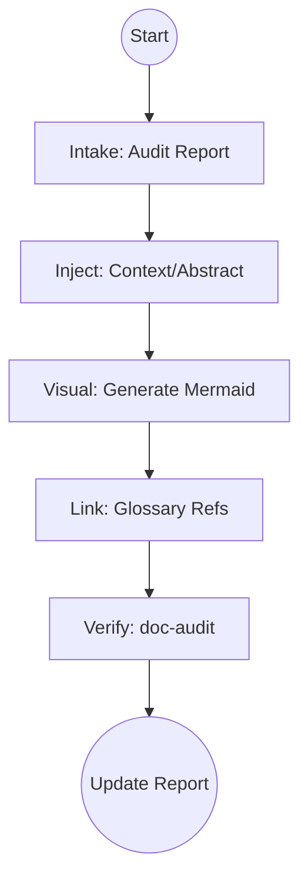

# Heal Structural Debt

## Context
Systematic workflow for addressing structural debt in the AI Kernel.

## Architecture

## Steps

1. **Intake**: Read the **[Structural Audit Report](../context/audit-reports/structural-audit-v1.5.1.md)** to identify the next target.
2. **Context Injection**:
    - If `## Context` or `## Abstract` is missing, synthesize a concise rationale based on the file's `summary`.
3. **Visual Synthesis**:
    - Invoke **[Generate Mermaid Diagram](../skills/generate-mermaid-diagram.skill.md)** to analyze the file's steps.
    - Insert the resulting Mermaid block under a new `## Architecture` header.
4. **Linkage Check**:
    - Ensure all items in `glossary_refs` are linked in the newly added sections.
5. **Verify**:
    - Run **[Audit Technical Documentation](../skills/doc-audit.skill.md)** on the healed file.
    - Update the status in the Audit Report.

## Postconditions
1. The system state matches the goal defined in the frontmatter.
2. All related Knowledge Graph nodes are updated and linked.

## Quality Gate

Documentation integrity is governed by our documentation standards.
- **Verification**: The Mermaid diagram must be renderable and logic-accurate.
- **Enforcement**: Files with ❌ status in the Audit Report are **Unacceptable (U)** for promotion to a stable release.
