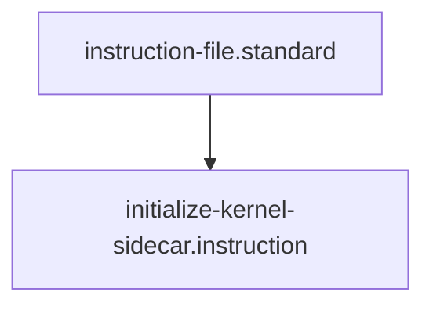

# Sidecar Initialization Protocol

## Context
The AI Kernel is designed to operate as a "Governance Sidecar." It does not live inside your source code; it lives *beside* it in the same workspace, providing standards, skills, and glossary definitions that are shared across all your projects.

## Execution Steps

### 1. Workspace Configuration
- **Action**: Add the `ai-kernel` repository to your IDE workspace (VS Code Multi-root or similar).
- **Verification**: Ensure you can reach both `/target-repo` and `/ai-kernel` from the same agent context.

### 2. Canonical Entrypoint Injection
- **Action**: Update the target repository's primary agent instructions (e.g., `CLAUDE.md`, `README.md`, or `.cursorrules`).
- **Template**:
  > "This project is governed by the AI Kernel sidecar located at [PATH]. Before making any architectural changes, you MUST load the relevant Standards from [PATH]/standards and validate the impact using [PATH]/skills/trace-impact-chain.md."

### 3. Registry Interlock
- **Action**: Create a symlink or a reference in the target repo's `.gemini` or `.ai` folder pointing to the Kernel's `registry/`.
- **Verification**: Run `python3 [PATH]/drivers/kernel/repo_aggregator.py` to confirm the Sidecar can see the target repository.

### 4. Integrity Handshake
- **Action**: Run the `global-healing-wave.skill` from the Sidecar, targeting the Target Repo.
- **Verification**: Ensure the Sidecar correctly identifies the target's node types.

## Quality Gate
- **Verification**: The target repository agents must be able to cite Glossary terms from the Sidecar.
- **Enforcement**: Any target repo commit that violates a Sidecar Standard is considered **Unacceptable (U)**.

## Architecture

