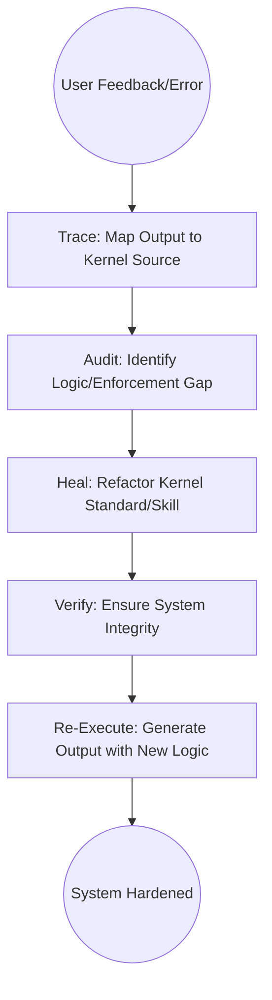

# Kernel-First Remediation

## Context
When an AI agent fails, the traditional response is to fix the specific output. In the AI Kernel, we reject this "Patching" culture. This instruction mandates **Systemic Learning**: we trace every failure back to its root standard or instruction, fix the "Factory" (the Kernel), and only then re-generate the product.

## Architecture

## Steps

1. **Intake**: The **Operator** captures the user's feedback and the sub-optimal output snippet.
2. **Trace**: Flynn runs `trace-output-to-source.skill` to identify the active instructions, skills, and agents.
3. **Analyze**:
    - Task the **Semantic Auditor** to check the instructions for complexity/ambiguity.
    - Task the **Standards Auditor** to check the PADU tables for "Enforcement Gaps".
4. **Heal Kernel**:
    - Run `refactor-to-kernel-standards.instruction` on the identified components.
    - If the error was caused by a missing rule, task the **Standards Scout** to codify a new one.
5. **Verify Fix**: Run `maintain-kernel-integrity.instruction` to ensure the fix hasn't introduced new violations.
6. **Re-Execute**: Once the kernel is hardened, the **Operator** re-runs the original user request using the updated logic.

## Postconditions
1. The system state matches the goal defined in the frontmatter.
2. All related Knowledge Graph nodes are updated and linked.

## Quality Gate

Systemic learning is governed by the **[Kernel Standard](../standards/kernel.standard.md)**.
- **Verification**: The remediation must update at least one `.[type].md` file in the kernel core.
- **Enforcement**: Direct "one-off" fixes to the user's output without a corresponding kernel update are **Discouraged (D)**.
---
**Rationale**: We fix the factory, not just the individual product.
