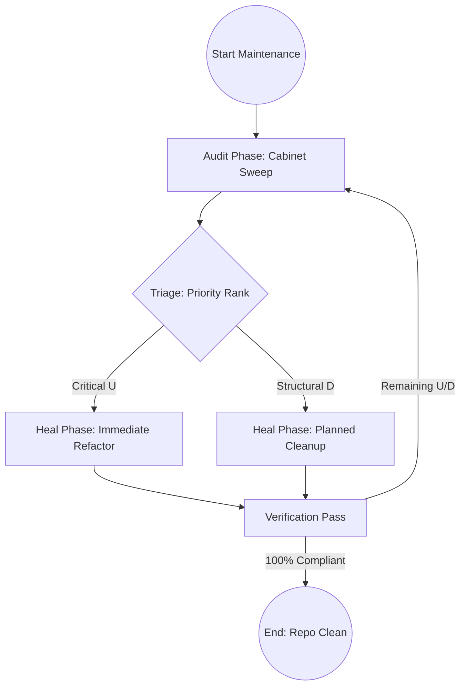

# Maintain Kernel Integrity

## Context
The AI Kernel is a complex, evolving Knowledge Graph. Without automated maintenance, "Entropy" causes naming collisions, orphaned nodes, and semantic drift. This instruction establishes a **Deterministic Self-Healing Loop** that ensures the repository remains "Hardened" as it scales.

## Architecture

## Steps

### 1. Audit Phase (Detection)
Flynn invokes the **[Cabinet Audit Workflow](flynn.agent.md#interaction-pattern)**:
- **Integrity Guardian**: Structural check + **[Check ID Uniqueness](../skills/check-id-uniqueness.skill.md)**.
- **Linkage Specialist**: Connectivity check + **[Audit Repository Connectivity](../skills/audit-repository-connectivity.skill.md)**.
- **Semantic Auditor**: Logic check.
- **Standards Auditor**: Compliance check.
- **Librarian**: **Manifest Check** (Ensure READMEs are up-to-date).
- **Standards Scout**: **[Promotion Analysis](../standards/promotion.standard.md)**.

### 2. Triage Phase (Prioritization)
Flynn ranks the identified violations:
1. **Critical (U)**: **ID Collisions**, Circularity, missing frontmatter.
2. **Structural (U)**: **Orphaned nodes**, non-atomic skills.
3. **Evolutionary (U/D)**: Patterns requiring **Promotion**, Versioning drift.

### 3. Healing Phase (Remediation)
Flynn iterates through the prioritized list:
- **Refactor**: Invoke **[Refactor to Kernel Standards](refactor-to-kernel-standards.instruction.md)**.
- **Codification**: If the **Standards Auditor** flags an "Enforcement Gap" or an un-codified pattern, invoke the **Standards Scout** via **[Codify Emerging Pattern](codify-emerging-pattern.instruction.md)**.
- **Manifests**: Task the **Librarian** to regenerate or update `README.md` files to reflect new core files.
- **Linkage**: For every orphaned node, task the **Linkage Specialist** to find a parent standard or related term.
- **Versioning**: Update `version` and `updated` fields according to the **[Versioning Standard](../standards/versioning.standard.md)**.

### 4. Verification Pass (Validation)
Re-run the **Audit Phase** on the modified files. Loop until zero **Unacceptable (U)** violations remain.

## Postconditions
1. The system state matches the goal defined in the frontmatter.
2. All related Knowledge Graph nodes are updated and linked.

## Quality Gate

Maintenance health is governed by the **[Kernel Standard](../standards/kernel.standard.md)**.
- **Verification**: Zero collisions, Zero orphans, and 100% Versioning compliance.
- **Enforcement**: Flynn will not approve any PR that has an ID collision or a disconnected node.
