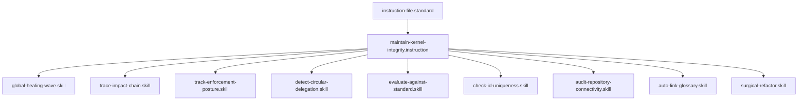

# Maintain Kernel Integrity

## Context
The AI Kernel is a complex, evolving Knowledge Graph. Without automated maintenance, "Entropy" causes naming collisions, orphaned nodes, and semantic drift. This instruction establishes a **Deterministic Self-Healing Loop** that ensures the repository remains "Hardened" as it scales.

## Architecture

## Execution Steps

### 1. Audit Phase (Detection)
Invoke the **[Hardened Audit Suite]**:
- **Safety**: Run `detect-circular-delegation.skill` to ensure a DAG.
- **Structural**: Run `check-id-uniqueness.skill` and `audit-repository-connectivity.skill`.
- **Compliance**: Run `evaluate-against-standard.skill` on any modified files.

### 2. Triage Phase (Prioritization)
Use `trace-impact-chain.skill` to analyze the "Blast Radius" of identified violations. Rank issues by their systemic risk.

### 3. Healing Phase (Remediation)
Execute the **[Restoration Wave]**:
- **Mass Restoration**: Run `global-healing-wave.skill` to repair frontmatter, links, and diagrams.
- **Surgical Refactor**: Invoke `surgical-refactor.skill` for complex structural repairs.
- **Maturity Check**: Run `track-enforcement-posture.skill` to verify the new automation coverage.

### 4. Verification Pass (Validation)
Re-run the **Audit Phase**. Loop until the `global-gap-report.md` shows **Zero Fails**.

## Postconditions
1. The system state matches the goal defined in the frontmatter.
2. All related Knowledge Graph nodes are updated and linked.

## Quality Gate

Maintenance health is governed by the **[Kernel Standard](../standards/kernel.standard.md)**.
- **Verification**: Zero collisions, Zero orphans, and 100% Versioning compliance.
- **Enforcement**: Flynn will not approve any PR that has an ID collision or a disconnected node.
