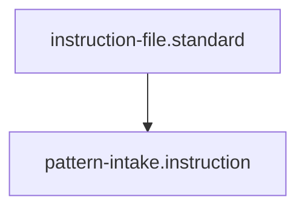

---
id: pattern-intake.instruction
title: Pattern Intake Protocol
type: instruction
tags: [pattern, discovery, standardization, workflow]
summary: A protocol for identifying, documenting, and codifying recurring code or documentation patterns into the project's governance.
parent_standard: instruction-file.standard
glossary_refs: [frontmatter.glossary, standard.glossary]
---[Home](/) > [Docs](/docs/readme.md) > [Governance](/docs/governance/readme.md) > [Protocol](readme.md) > Pattern Intake

## 1. Objective
Extract a novel code or document structure, define it as a contextless geometry [Pattern], and assign its contextual fitness in a [Standard].

## 2. Extraction & Decontextualization
- **Action:** Analyze the target code or document. Strip away all domain-specific variables, business logic, and contextual "opinions."
- **Verify:** The remaining structure must be a pure "Platonic shape" (e.g., "A class that implements an interface and returns a Result object").

## 3. Pattern Materialization
- **Action:** Create a new file in `docs/developer/pattern/` using expressive, singular naming (e.g., `data-repository-abstraction.md`).
- **Action:** Include the standard YAML frontmatter (`id`, `type: pattern`, `tags`).
- **Verify:** The file contains absolutely no "best practice" or "should/must" language regarding its usage.

## 4. Shadow Indexing
- **Action:** Open `docs/developer/pattern/readme.md`.
- **Action:** Add the new pattern under the most relevant human-facing Concern heading.
- **Action:** Update the YAML `index_map` at the bottom of the README to ensure RAG pipelines can traverse it.
- **Verify:** The pattern is now searchable and traversable by the DaC engine.

## Architecture

