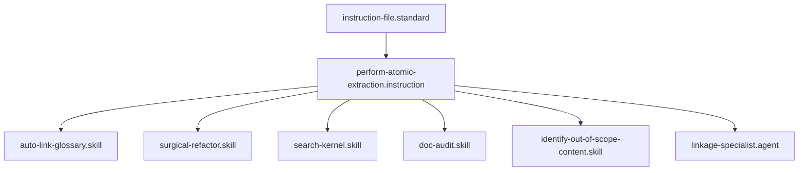

# Perform Atomic Extraction

## Context
This instruction is the "Scalpel" of the AI Kernel. It orchestrates the removal of foreign logic and the insertion of SSOT links, ensuring that the system remains atomic as it evolves.

## Architecture

## Execution Steps
1. **Isolation**: Capture the exact character-range of the out-of-scope content.
2. **Transfer**: Create a new file in the appropriate domain (e.g., `glossary/*.md`) with the extracted content.
3. **Formalization**: Apply the mandatory headers (Context, Architecture, Gate) to the new file.
4. **Linkage**: Replace the original content block in the source file with a markdown link to the new node.
5. **Validation**: Run the **Connectivity Audit** to ensure the new node is reachable.

## Postconditions
1. The source file no longer contains the out-of-scope logic.
2. A new, fully compliant SSOT node exists in the correct domain.
3. A reachable link exists from the source to the target.

## Quality Gate
- **Verification**: The extraction must not result in "Dead Nodes" (orphans).
- **Enforcement**: Any extraction that removes logic without providing a functional replacement link is **Unacceptable (U)**.
