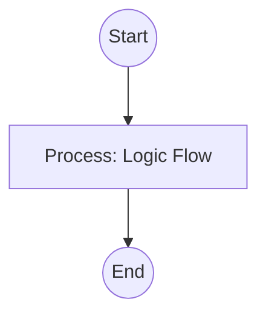

## Context
Orchestrates a repository-wide check for frontmatter completeness and validity.

# Perform Frontmatter Audit

This instruction ensures every file in the AI Kernel is a valid node in the Knowledge Graph.

## Architecture

## Steps

1. **Completeness Check**: Run `audit-frontmatter-completeness.skill` on all markdown files (excluding READMEs).
2. **Integrity Check**: Run the `Verify Repository Integrity` instruction to ensure all IDs resolve.
3. **[Quality Gate](glossary/quality-gate.glossary.md)**: - If any mandatory fields are missing, flag as a critical failure.
    - If IDs do not match filenames (standard practice), suggest renaming.
4. **Report**: provide a compliance report for the Standards Auditor.

## Postconditions
1. The system state matches the goal defined in the frontmatter.
2. All related Knowledge Graph nodes are updated and linked.
