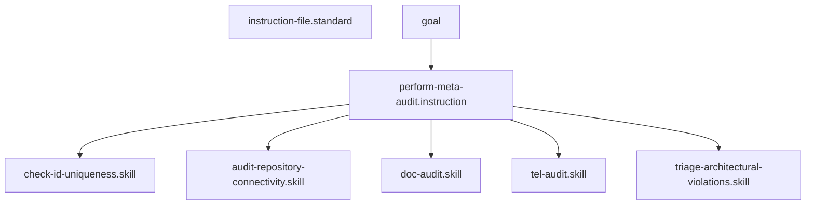

# Perform Meta-Audit

## Context
The Meta-Audit is the "Supreme Court" of the AI Kernel. It runs every specialized auditor and uses the **Triage Skill** to produce a single, prioritized backlog of work.

## Architecture

## Execution Steps
1. **Structural Pass**: Run `check-id-uniqueness.skill` and `audit-frontmatter-completeness.skill`.
2. **Connectivity Pass**: Run `audit-repository-connectivity.skill`.
3. **Semantic Pass**: Run `doc-audit.skill` and `tel-audit.skill`.
4. **Synthesis**: Pass all findings to `triage-architectural-violations.skill`.
5. **Reporting**: Create a new `context/supreme-audit-[version].md` report.

## Postconditions
1. A new, dated supreme audit report exists in `/context/`.
2. The report identifies 100% of P0-P3 violations currently present in the graph.

## Quality Gate
- **Verification**: The Meta-Audit must be reproducible.
- **Enforcement**: No "Push" to stable is allowed if the Meta-Audit report contains P0 or P1 violations.
