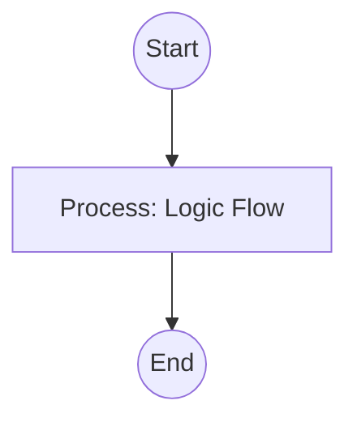

## Context
Orchestrates the research and synthesis phase of standard creation.

# Populate Standard

This instruction guides the **[Standards Scout](../agents/standards-scout.agent.md)** through the data-gathering phase of codification.

## Architecture

## Steps

1. **Industry Research**: Run `research-domain-patterns.skill` to identify global best practices for the target domain.
2. **Codebase Scan**: Run `scan-codebase-patterns.skill` to identify how the domain is currently handled in the repository.
3. **Synthesis**: Run `generate-padu-table.skill` to combine research and reality into a draft PADU table.

## Postconditions
1. The system state matches the goal defined in the frontmatter.
2. All related Knowledge Graph nodes are updated and linked.

## Quality Gate

Standard accuracy is governed by the **[Standard File Standard](../standards/standard-file.standard.md)**.
- **Verification**: Ensure the generated PADU table includes at least one **Unacceptable (U)** practice to provide clear boundaries.
- **Enforcement**: If the table contains only **Preferred (P)** practices, it is considered "soft" and must be re-evaluated for more rigorous enforcement.
