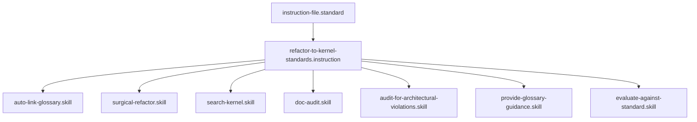

## Context
A maximalist workflow for aligning repository content with the core architectural principles of the AI Kernel.

# Refactor to Kernel Standards

This instruction codifies the "maximalist extraction" process used to maintain the framework's integrity.

## Architecture

## Execution Steps

1. **Audit**: Run [audit-for-architectural-violations.skill](../skills/audit-for-architectural-violations.skill.md) across the target directory or file.
2. **Glossary Extraction**:
    - For every inline concept found, use [provide-glossary-guidance.skill](../skills/provide-glossary-guidance.skill.md).
    - If `NEW_ENTRY` is recommended, execute [create-glossary-entry.instruction](create-glossary-entry.instruction.md).
    - Replace the inline definition with a link to the new glossary file.
3. **Modularization**:
    - If a **Skill** is found to be non-atomic, decompose it into new atomic skills.
    - Create a new **Instruction** to orchestrate the new skills.
4. **Standard Extraction**:
    - If a skill or instruction contains "hardcoded" quality rules, move them to a relevant **Standard** (PADU table).
5. **Commit**: Save and propose changes.

## Postconditions
1. The system state matches the goal defined in the frontmatter.
2. All related Knowledge Graph nodes are updated and linked.

## Quality Gate

Architectural integrity is governed by the **[Kernel Standard](../standards/kernel.standard.md)**.
- **Verification**: Run `evaluate-against-standard.skill` on the new/refactored files using the relevant file-type standards.
- **Enforcement**: If any refactored file receives a **Unacceptable (U)** rating, the refactor is considered incomplete and must be re-processed.
