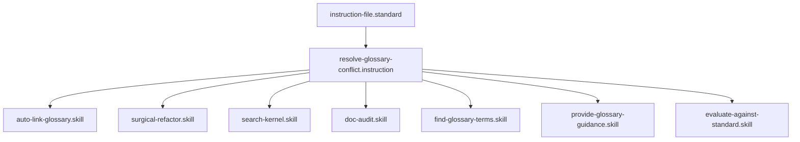

## Context
Workflow for merging similar glossary entries or clarifying ambiguous terms.

# Resolve Glossary Conflict

Flynn's workflow for maintaining the "Single Source of Truth" in the glossary.

## Architecture

## Execution Steps

1. **Map the Conflict**: List the IDs and summaries of all conflicting entries.
2. **Evaluate Core Intent**: Determine the primary concept that encompasses all variants.
3. **Select Canonical Term**: Choose the most descriptive and standard term as the primary `id`.
4. **Merge Content**: Combine the best parts of all definitions into the canonical file.
5. **Update Aliases**: Add the decommissioned terms to the `aliases` field of the canonical entry.
6. **Redirect References**: (Optional but Recommended) Search for references to the old IDs and update them to point to the new canonical entry.
7. **Decommission**: Delete the redundant files.

## Postconditions
1. The system state matches the goal defined in the frontmatter.
2. All related Knowledge Graph nodes are updated and linked.
