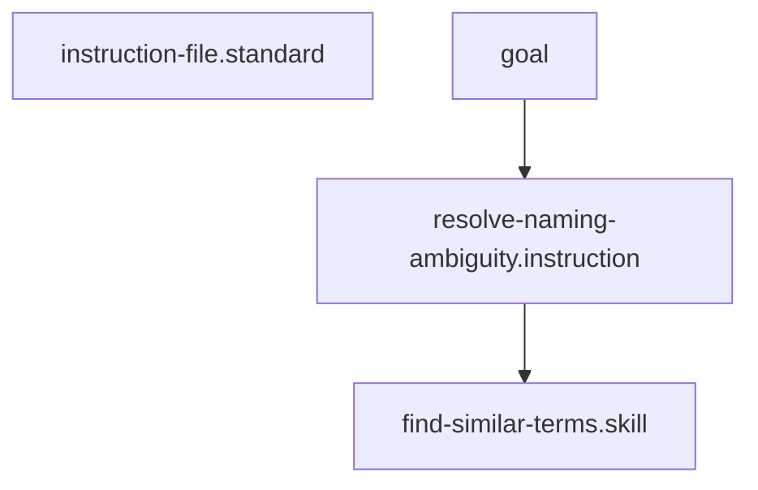

# Resolve Naming Ambiguity

## Context
Naming ambiguity is the "Friction" of a Knowledge Graph. This instruction provides the path for resolving collisions by leveraging the **Naming Standard** to enforce uniqueness and deterministic suffixes.

## Architecture

## Execution Steps

1. **Detection**: Identify the ambiguous term or collision ID.
2. **Semantic Review**: Invoke **[Find Similar Terms](../skills/find-similar-terms.skill.md)** to understand the scope of the ambiguity.
3. **Application**: Apply the **[Naming Standard](../standards/naming.standard.md)** to generate a new, unique ID.
    - Prioritize functional suffixes (e.g., `.skill`, `.standard`).
4. **Graph Update**: Globally replace all references to the old ID with the new ID.
5. **Validation**: Run the **[ID Uniqueness Check](../skills/check-id-uniqueness.skill.md)** to confirm the fix.

## Postconditions
1. The system state matches the goal defined in the frontmatter.
2. All related Knowledge Graph nodes are updated and linked.

## Quality Gate

Naming integrity is governed by the **[Naming Standard](../standards/naming.standard.md)**.
- **Verification**: The new ID must be unique across the entire repository.
- **Enforcement**: Any node with a non-deterministic or duplicate ID is **Unacceptable (U)** and will be rejected by the **Integrity Guardian**.
