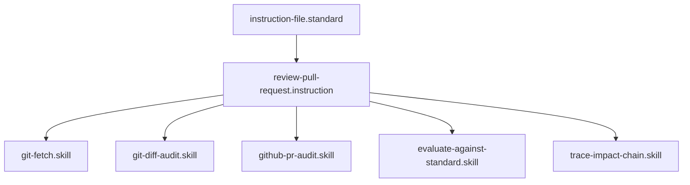

# Review Pull Request

## Context
High-integrity development requires a bridge between "Automated Audits" and "Human Intent." This instruction codifies the process of ingesting PR metadata (diffs, comments) to ensure that the final merge preserves the Diamond Logic of the AI Kernel.

## Architecture

## Execution Steps

### 1. Synchronization Phase
1. **Fetch**: Invoke `git-fetch.skill` to synchronize remote branch metadata.
2. **Checkout**: Switch the local workspace to the PR's source branch.

### 2. Data Ingestion Phase
1. **Audit Diffs**: Run `git-diff-audit.skill` to identify the files modified in the PR.
2. **Audit Comments**: Invoke `github-pr-audit.skill` to ingest human reviewer feedback and change requests.

### 3. Impact Analysis Phase
1. **Blast Radius**: For every modified core node (Glossary, Standard), run `trace-impact-chain.skill` to identify secondary breakage.
2. **Compliance**: Run `evaluate-against-standard.skill` on all modified files to ensure zero logic debt.

### 4. Triage & Synthesis
1. **Comparison**: Analyze the solution against the reviewer comments.
2. **Remediation**: If conflicts exist, invoke `maintain-kernel-integrity.instruction` to heal the drift.

## Postconditions
1. All reviewer comments have been addressed or triaged.
2. The PR branch is in 100% compliance with repository standards.

## Quality Gate
Review integrity is governed by the **[Kernel Standard](../standards/kernel.standard.md)**.
- **Verification**: Zero standard violations on the PR branch.
- **Enforcement**: Flynn will not approve a PR until all `github-pr-audit` comments are addressed.
