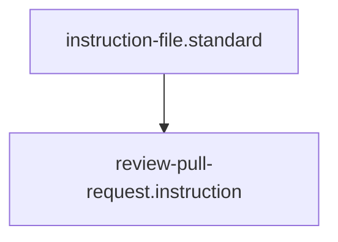

---
id: review-pull-request.instruction
title: Review Pull Request
type: instruction
tags: [workflow, git, github, review, audit, process, orchestration]
summary: A workflow for synchronizing local state with a Pull Request and auditing the changes against repository standards and human reviewer feedback.
parent_standard: instruction-file.standard
glossary_refs: [context.glossary, instruction.glossary, skill.glossary, standard.glossary]
---# Review Pull Request

## Context
High-integrity development requires a bridge between "Automated Audits" and "Human Intent." This instruction codifies the process of ingesting PR metadata (diffs, comments) to ensure that the final merge preserves the Diamond Logic of the AI Kernel.

## Execution Steps

### 1. Synchronization Phase
1. **Fetch**: Invoke `git-fetch.skill` to synchronize remote branch metadata.
2. **Checkout**: Switch the local workspace to the PR's source branch.

### 2. Data Ingestion Phase
1. **Audit Diffs**: Run `git-diff-audit.skill` to identify the files modified.
2. **Audit Comments**: Invoke `github-pr-audit.skill` to ingest human reviewer feedback.
3. **Walkthrough Verification**: [NEW] Confirm the PR includes a formal Walkthrough. Any PR without a walkthrough is a **Standard Violation (A)**.

### 3. Impact Analysis Phase
1. **Blast Radius**: For every modified core node, run `trace-impact-chain.skill`.
2. **Observability Compliance**: [NEW] Execute `observability_standard.skill` to verify that new modules have telemetry spans and runbooks.
3. **Compliance**: Run `evaluate-against-standard.skill` on all modified files.

### 4. Triage & Synthesis
1. **Comparison**: Analyze the solution against the reviewer comments.
2. **Remediation**: If conflicts exist, invoke `maintain-kernel-integrity.instruction`.

## Quality Gate
- **Verification**: Zero standard violations on the PR branch.
- **Enforcement**: Flynn will not approve a PR until all `github-pr-audit` comments are addressed and the **Observability Gate** is cleared.

## Architecture

